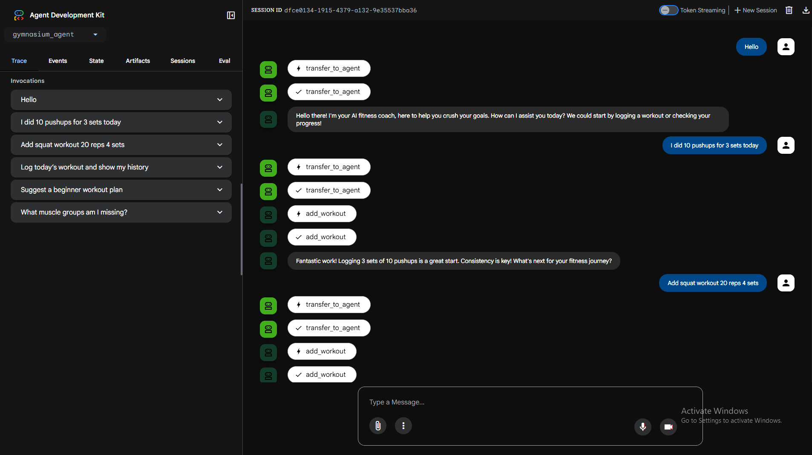
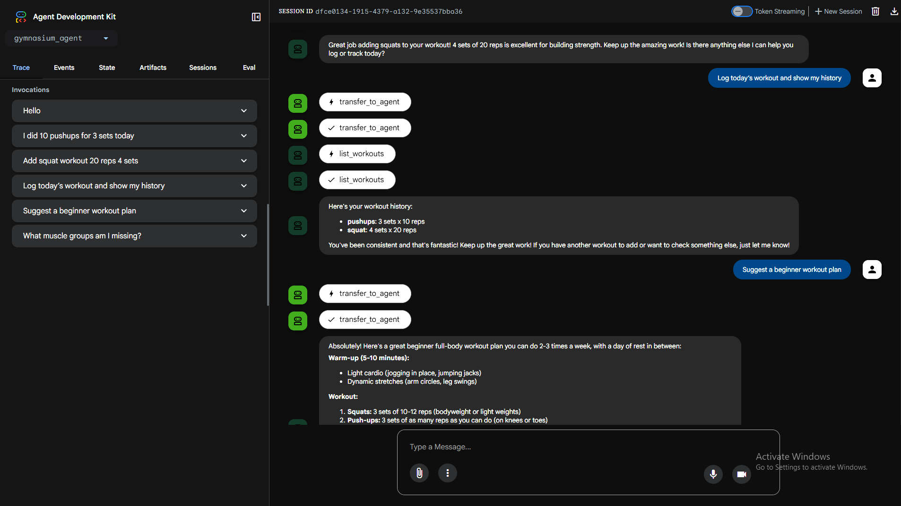
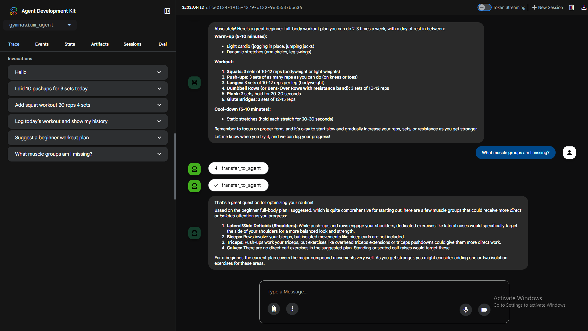

# 🏋️Gymnasium AI Agent

## 🚀 Overview
Gymnasium AI Agent is a multi-agent AI system designed to help users manage workouts, track fitness progress and receive intelligent exercise guidance. The system demonstrates -
* Multi-agent coordination.
* Tool integration via MCP (Model Context Protocol).
* Persistent data storage using a database.
* Multi-step workflow execution.
* API-based deployment.

This project simulates a real-world AI fitness assistant capable of reasoning, planning and executing actions using tools.

📄 Google Cloud Run Link - https://student-guide-315961907444.europe-west1.run.app

## Quick Glance
<p align="center">
  <br>
  <br>
  <br>
</p>

## 🧠 Key Features
### ✅ Multi-Agent Architecture
* Root Agent → Handles user input and orchestrates flow.
* Gym Coach Agent → Executes fitness-related tasks.

### 🔧 MCP Tool Integration
* Log workouts.
* Track fitness progress.
* Retrieve workout history.
* Store structured data.

### 💾 Persistent Storage
* Uses Google Cloud Datastore.
* Stores -
  * Workout sessions.
  * Fitness progress logs.

### 🔄 Multi-Step Workflow Handling
* Supports chained operations -
  * Log workout + track weight.
  * Retrieve history after logging.
  * Combine multiple tool calls in one request.

### 🌐 API-Based System
* Built with FastAPI.
* Fully deployable backend service.

## 🏗️ System Architecture
```
User Input
   ↓
Root Agent (Intent Handling)
   ↓
Gym Coach Agent (Execution)
   ↓
MCP Tools (Workout / Progress)
   ↓
Database (Datastore)
   ↓
Response to User
```

## 🧩 Agents
### 🧠 Root Agent
* Receives user input.
* Stores input in shared state.
* Delegates execution to workflow agent.

### 🏋️ Gym Coach Agent
Responsible for -
* Workout tracking.
* Fitness guidance.
* Progress logging.
* Tool invocation.

## 🔧 MCP Tools
### 1. add_workout
Logs a workout session.

Input -
* exercise.
* reps.
* sets.

### 2. list_workouts
Retrieves all logged workouts.

### 3. log_fitness_progress
Stores weight and notes.

Input -
* weight.
* note.

### 4. get_progress
Returns fitness history.

## 💾 Database Schema
### Workout Entity
| Field      | Type     |
| ---------- | -------- |
| exercise   | string   |
| reps       | int      |
| sets       | int      |
| created_at | datetime |

### FitnessLog Entity
| Field  | Type     |
| ------ | -------- |
| weight | float    |
| note   | string   |
| date   | datetime |

## 📡 API Usage
### Endpoint -
```
POST /api/v1/gymnasium/chat
```

### Request Body -
```json
{
  "prompt": "Log workout: pushups 15 reps 3 sets"
}
```

### Response -
```json
{
  "status": "success",
  "reply": "🏋️ Workout 'pushups' logged (ID: 123)"
}
```

## 🧪 Testing the Agent
### ✅ Basic Commands
* Log workout - pushups 15 reps 3 sets.
* Show my workouts.

### 🔄 Multi-Step Commands
* Log workout and show history.
* Add workout and log my weight as 70kg.

### 📊 Progress Tracking
* Log my weight as 75kg.
* Show my progress.

### 🧠 Intelligent Queries
* Suggest a beginner workout plan.
* What should I do for chest day?

## 🏆 Project Highlights
* Demonstrates agent orchestration.
* Uses real tool execution (MCP).
* Implements persistent memory.
* Handles multi-step workflows.
* Designed as a real-world AI system.

## 🚀 Future Enhancements
* 📅 Workout scheduling with calendar integration.
* 🧠 Adaptive workout planning (AI-based).
* 📊 Dashboard (Streamlit) for visualization.
* 🍎 Diet planning agent.
* 📈 Progress analytics and insights.

## 🧠 Technical Stack
* Backend - FastAPI.
* Agents - Google ADK.
* Tools - MCP (FastMCP).
* Database - Google Cloud Datastore.
* LLM - Gemini (configurable).

## 📌 Why This Project Matters
This project showcases how AI agents move beyond chatbots into -
* Action-oriented systems.
* Tool-using assistants.
* Workflow automation engines.

It bridges the gap between -
> Conversation → Execution → Real-world impact.
