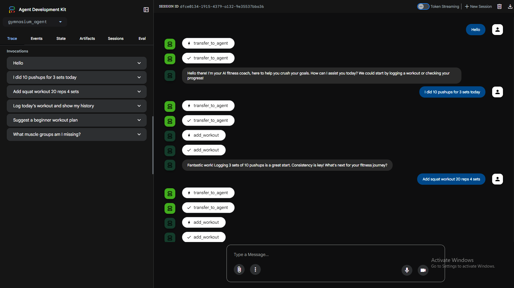
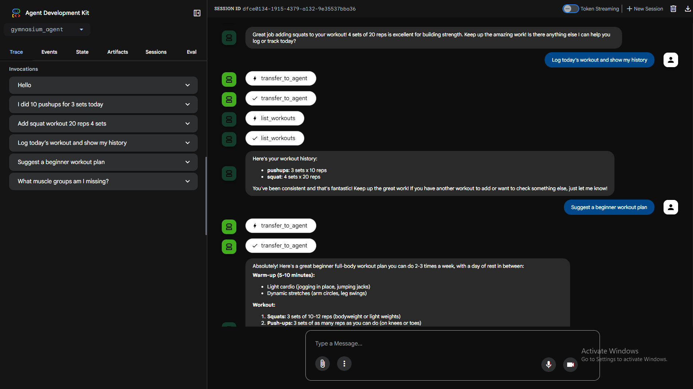
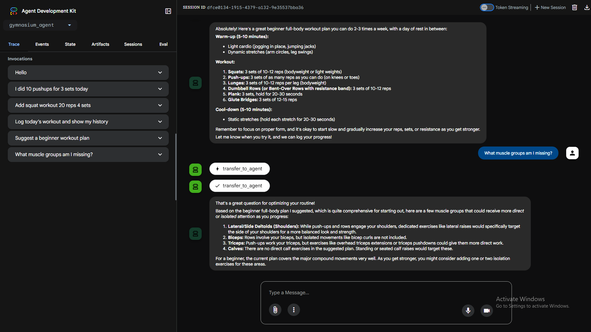

# 🏋️ Gymnasium AI Agent (Roman)

## 🚀 Overview
**Gymnasium AI Agent** is a multi-agent AI system designed to help you manage workouts, track fitness progress and receive intelligent exercise guidance. The system demonstrates -
* Multi-agent coordination (ADK).
* Native tool integration for database operations.
* Persistent data storage using SQLite.
* Multi-step workflow execution.
* API-based deployment on Render.

This project simulates a real-world AI fitness assistant capable of reasoning, planning and executing actions using tools.

🌐 **Live Demo** → https://gymnasium-ai-agent.onrender.com

## Quick Glance
<p align="center">
  <br>
  <br>
  <br>
</p>

## 🧠 Key Features
### ✅ Multi-Agent Architecture
* **Root Agent** → Handles user input and orchestrates flow.
* **Roman (Gym Coach Agent)** → Motivates, plans and executes fitness-related tasks.

### 🔧 Native Tool Integration
* Log workouts.
* Track fitness progress.
* Retrieve workout history.
* Store structured data.

### 💾 Persistent Storage
* Uses a local SQLite Database (`gymnasium.db`).
* Stores -
  * Workout sessions.
  * Fitness progress logs.

### 🔄 Multi-Step Workflow Handling
* Supports chained operations - 
  * Log workout + track weight.
  * Retrieve history after logging.
  * Combine multiple tool calls in one request.

### 🌐 API-Based System
* Built with FastAPI.
* Fully deployable backend service on Render.

## 🏗️ System Architecture
```text
User Input
   ↓
Root Agent (Intent Handling)
   ↓
Roman / Gym Coach Agent (Execution)
   ↓
Tools (Workout / Progress)
   ↓
SQLite Database
   ↓
Response to User
```

## 🧩 Agents
### 🧠 Root Agent
* Receives user input.
* Stores input in shared state.
* Delegates execution to workflow agent.

### 🏋️ Roman (Gym Coach Agent)
Responsible for - 
* Workout tracking.
* Fitness guidance.
* Progress logging.
* Tool invocation.

## 🧠 Technical Stack
* **Backend -** FastAPI.
* **Agents -** Google ADK.
* **LLM Integration -** LiteLLM.
* **Database -** SQLite.
* **LLM Provider -** Groq (Llama 3).

## 🔧 Tools Included
### 1. `add_workout`
Logs a workout session (exercise, reps, sets).

### 2. `list_workouts`
Retrieves recent logged workouts.

### 3. `log_fitness_progress`
Stores body weight and notes.

### 4. `get_progress`
Returns fitness history.

## 💾 Database Schema (SQLite)
### `workouts` Table
| Field      | Type     |
| ---------- | -------- |
| id         | INTEGER  |
| exercise   | TEXT     |
| reps       | INTEGER  |
| sets       | INTEGER  |
| created_at | TEXT     |

### `progress` Table
| Field      | Type     |
| ------     | -------- |
| id         | INTEGER  |
| weight     | REAL     |
| note       | TEXT     |
| created_at | TEXT     |

## 📡 API Usage
### Endpoint
```http
POST /api/v1/gymnasium/chat
```

### Request Body
```json
{
  "prompt": "Log workout: pushups 15 reps 3 sets"
}
```

### Response
```json
{
  "status": "success",
  "reply": "🏋️ Workout 'pushups' logged (ID: 1)"
}
```

## 🚀 Deployment Details
* **Hosted on -** Render.
* **Containerized using -** Docker.
* **AI Provider -** Groq via LiteLLM (`llama-3.3-70b-versatile`).

### Environment Variables Required
* `GROQ_API_KEY` - Your Groq API key.
* `MODEL` - llama-3.3-70b-versatile.

## 🧪 Testing the Agent
### ✅ Basic Commands
* "Log workout - pushups 15 reps 3 sets."
* "Show my recent workouts."

### 🔄 Multi-Step Commands
* "Log my workout and show my history."
* "Add workout and log my weight as 70kg."

### 📊 Progress Tracking
* "Log my weight as 75kg feeling great."
* "Show my progress."

### 🧠 Intelligent Queries
* "Suggest a beginner workout plan."
* "What should I do for chest day?"

## 🏆 Project Highlights
* Demonstrates agent orchestration.
* Implements persistent memory.
* Handles multi-step workflows.
* Designed as a real-world AI system.

## 🚀 Future Enhancements
* 📅 Workout scheduling with calendar integration.
* 🧠 Adaptive workout planning (AI-based).
* 📊 Dashboard (Streamlit) for visualization.
* 🍎 Diet planning agent.
* 📈 Progress analytics and insights.
